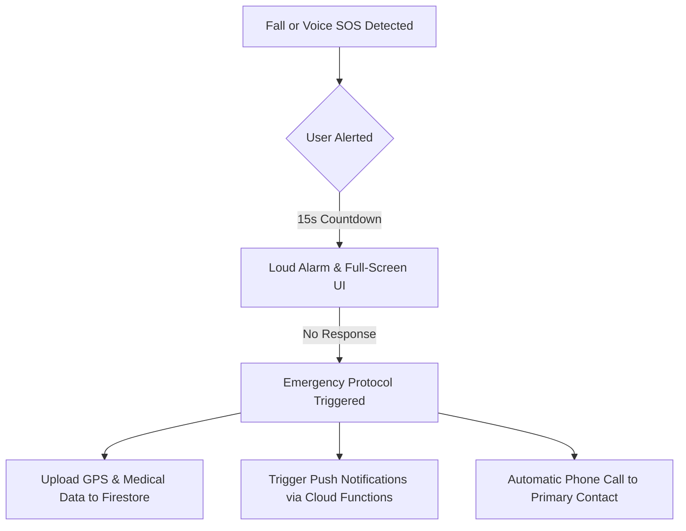

# FallDetector — Android App

FallDetector is an advanced safety application for Android designed to protect seniors and individuals at risk. By leveraging hardware sensors and AI-powered voice recognition, the app detects falls and emergency situations in real-time, automatically alerting emergency contacts and providing vital medical information to first responders.

---

## 🛠 How It Works



1.  **Background Monitoring**: High-priority Foreground Services (`FallDetectionService` & `VoiceDetectionService`) monitor the device 24/7.
2.  **Detection**:
    - **Physical**: Analyzes accelerometer data for freefall patterns followed by high-impact spikes ($G$-force magnitude).
    - **Voice**: Listens for specific keywords like *"Ajutor detector"* or *"Te rog nu mai da"* using the Google Speech API.
3.  **The "Golden Window"**: A 15-second countdown gives the user a chance to cancel false alarms before help is summoned.
4.  **Automatic Escalation**: If the user is incapacitated, the app automatically notifies everyone in their emergency list via Firestore/FCM and dials their primary contact.

---

## ✨ Key Features

* **🛡️ Smart Fall Detection:** Distinguishes between dropping a phone and a human fall by analyzing acceleration patterns and post-impact orientation.
* **🗣️ Voice SOS (Keyword Trigger):** Optimized for the Romanian language (`ro-RO`). It processes speech in the background and starts the emergency sequence immediately upon hearing a trigger phrase.
* **🏥 Medical Profile & SOS:** Stores blood type, allergies, and medications. This data is automatically shared during an emergency event so responders have critical info at a glance.
* **📞 Auto-Emergency Calling:** Automatically initiates a phone call (`CALL_PHONE`) to a saved emergency number once a fall is confirmed.
* **📍 Live Location Tracking:** Continuously updates GPS coordinates in Firestore so responders can track the user's live position on an interactive map.

---

## 🏗 Architecture & Tech Stack

| Layer | Technology |
|---|---|
| **Language** | Kotlin |
| **Backend/Database** | Firebase Firestore, Firebase Authentication |
| **Cloud Logic** | Firebase Cloud Functions (Node.js) |
| **Intelligence** | Android SpeechRecognizer API, Hardware SensorManager |
| **Notifications** | Firebase Cloud Messaging (FCM) |
| **Location** | Google Play Services (Fused Location Provider) |

### Firestore Structure

```json
users/ {uid}
  ├── name, phone, email, fcmToken
  ├── medicalConditions, allergies, medication
  ├── lastLatitude, lastLongitude
  └── emergencyContacts: [ 
        { "name": "Contact Name", "phone": "+407..." },
        ... 
      ]

fall_events/ {eventId}
  ├── uid, name, timestamp, phone
  ├── latitude, longitude
  └── status: "confirmed"
```

---

## 📦 Local Setup

### 1. Clone the Project
```bash
git clone https://github.com/andreistana05/IT_Fest2026_ANDROID.git
cd IT_Fest2026_ANDROID
```

### 2. Configure Firebase
1. Create a project in the [Firebase Console](https://console.firebase.google.com/).
2. Add an Android app with the package name `com.falldetector.app`.
3. Download `google-services.json` and place it in the `app/` directory.
4. Enable **Firestore**, **Auth**, and **FCM**.

### 3. Deploy Cloud Functions
Navigate to the `functions` folder and deploy to handle real-time notifications:
```bash
cd functions
npm install
firebase deploy --only functions
```

---

## 👥 Team & Credits

This project was developed at **IT_FEST 2026** by:
- **Miroiu Andrei**
- **Nagiu Razvan**
- **Stepan Alexandru-Pavel**
- **Stana Andrei**
- **Abrudan Alexandru**

---

## 📖 Usage Guide

1.  **Setup Profile**: Go to the **Medical** tab and enter your health conditions.
2.  **Add Contacts**: In **Emergency Contacts**, add the people you want the app to notify.
3.  **Grant Permissions**: Ensure you allow **Location (All the time)**, **Microphone**, and **Phone** access.
4.  **Battery Optimization**: Disable battery optimization for the app to ensure background sensors stay active.
5.  **Test Voice**: While the app is in the background, say *"Ajutor detector"*. A 15-second alarm sequence should trigger.
